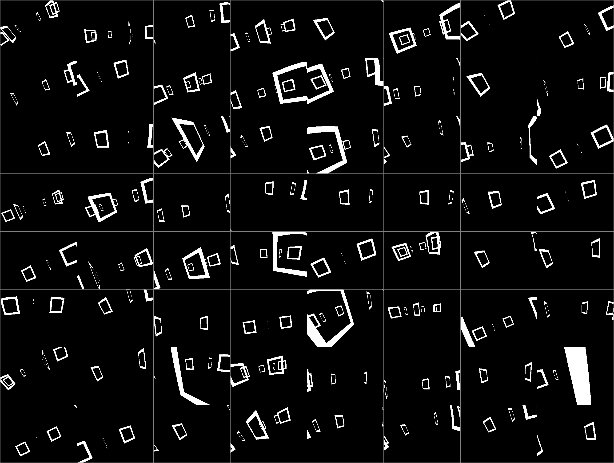

# gaterenderer

Massively-parallel CUDA ray-cast renderer that produces binary **segmentation
masks of square gate frames** for thousands of cameras at once. Built for
drone-gate perception/RL workloads. 

**~1.5 Million FPS(61x81 res, 6 gates) on an RTX 3050 Laptop GPU**



The renderer intersects a precomputed, undistorted ray per pixel against the
quads, and marks pixels that hit the *border* of a quad (the central hole is cut
out). Per-quad geometry is precomputed on the host into a per-renderer
global-memory buffer and staged into shared memory inside the kernel, so each
`GateRenderer` is fully independent.

## Requirements

- NVIDIA GPU + CUDA toolkit (the kernel is JIT-compiled on first use via
  `torch.utils.cpp_extension.load_inline`).
- PyTorch built for your CUDA version (install it yourself; not pinned here).

## Install

From the repository root:

```bash
pip install -e .              # editable install of the library
pip install -e ".[examples]"  # also pulls torchvision + tqdm for the demos
```

The CUDA kernel compiles the first time a `GateRenderer` is constructed and is
cached under `~/.cache/torch_extensions/`.

## Usage

```python
import torch
from gaterenderer import GateRenderer
from gaterenderer.sample_scene import (
    SAMPLE_CONFIG, SAMPLE_K, SAMPLE_D, CALIB_RES, scale_intrinsics,
)

render_res = (244, 324)  # (H, W)
renderer = GateRenderer(
    gate_config=SAMPLE_CONFIG,                               # [n_quads, 4, 3]
    n_cams=4096,
    K=scale_intrinsics(SAMPLE_K, CALIB_RES, render_res),
    D=SAMPLE_D,
    resolution=render_res,
    device="cuda",
)

# camera-to-world matrices, NWU world frame (x-forward, y-left, z-up)
c2w = torch.eye(4, device="cuda").repeat(4096, 1, 1)
masks = renderer.render(c2w)        # uint8 [n_cams, H, W]; reused buffer — clone to keep
```

Notes:
- `render()` returns an internal buffer that is overwritten on the next call. Call
  `.clone()` it if you need to retain a result.
- Each `GateRenderer` owns its quad geometry (a per-instance global-memory
  tensor), so multiple renderers with different geometry are independent and
  safe to interleave. Call `set_quads(new_vertices)` to update geometry in place.

## Examples

```bash
python examples/benchmark.py          # throughput benchmark, writes benchmark_output.png
python examples/interactive_viewer.py # WASD/arrow-key single-camera viewer
```

## Layout

```
src/gaterenderer/
  renderer.py        GateRenderer
  transforms.py      quaternion / euler helpers
  sample_scene.py    example gate geometry + calibration
  _kernel.py         JIT loader (cached)
  _kernels/          raycast.cu, raycast.cpp   (CUDA source, shipped as package data)
examples/            benchmark.py, interactive_viewer.py
```
